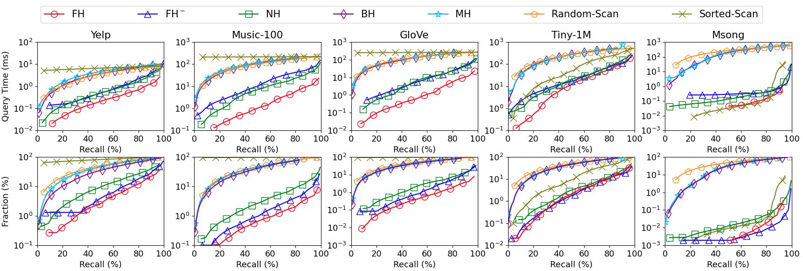

# P2HNNS: Point-to-Hyperplane Nearest Neighbor Search

<p align="center"></p>

Welcome to the **P2HNNS** GitHub!

**P2HNNS** is a toolbox for the problem of Point-to-Hyperplane Nearest Neighbor Search (P2HNNS). Given a set of data points and a hyperplane query, the problem of P2HNNS aims to find the nearest data point to the hyperplane query. It has plenty of applications in large-scale active learning with SVMs, maximum margin clustering, large-margin dimensionality reduction, etc.

This toolbox provides the implementations and experiments of our work [Point-to-Hyperplane Nearest Neighbor Search Beyond the Unit Hypersphere](https://dl.acm.org/doi/pdf/10.1145/3448016.3457240) in [SIGMOD 2021](https://2021.sigmod.org/). It also implements three state-of-the-art hyperplane hashing schemes (i.e., [Embedding Hyperplane hashing (EH)](https://citeseerx.ist.psu.edu/viewdoc/download?doi=10.1.1.185.4684&rep=rep1&type=pdf), [Bilinear Hyperplane hashing (BH)](https://icml.cc/Conferences/2012/papers/16.pdf), and [Multilinear Hyperplane hashing (MH)](https://openaccess.thecvf.com/content_cvpr_2016/papers/Liu_Multilinear_Hyperplane_Hashing_CVPR_2016_paper.pdf)) and two heuristic linear scan methods Random-Scan and Sorted-Scan.

## Datasets and Queries

We use five real-life [datasets](https://drive.google.com/drive/folders/1aBFV4feZcLnQkDR7tjC-Kj7g3MpfBqv7?usp=sharing) Yelp, Music-100, GloVe, Tiny-1M, and Msong in the experiments. For each dataset, we generate 100 hyperplane queries for evaluations. The statistics of datasets and queries are summarized as follows.

| Datasets  | #Data Objects | Dimensionality | #Queries | Data Size | Type   |
| --------- | ------------- | -------------- | -------- | --------- | ------ |
| Yelp      | 77,079        | 50             | 100      | 14.7 MB   | Rating |
| Music-100 | 1,000,000     | 100            | 100      | 381.5 MB  | Rating |
| GloVe     | 1,183,514     | 100            | 100      | 451.5 MB  | Text   |
| Tiny-1M   | 1,000,000     | 384            | 100      | 1.43 GB   | Image  |
| Msong     | 992,272       | 420            | 100      | 1.55 GB   | Audio  |

We show the heat-map of |cos 𝜃| and ∥***o***∥ and their histograms of the five real-life datasets in the following figure, where the histograms of |cos 𝜃| and ∥***o***∥ are depicted on the right and the top of the heat-map, respectively.

<p align="center"></p>

## Compilation

This toolbox requires ```g++-8``` with ```c++17``` support. Before the compilation, please check whether the `g++-8` is installed. If not, please install it first. We provide a way to install `g++-8` in Ubuntu 18.04 as follows.

```bash
sudo add-apt-repository ppa:ubuntu-toolchain-r/test
sudo apt-get update
sudo apt-get install g++-8
sudo apt-get install gcc-8 (optional)
```

To compile the c++ source codes, please type commands as follows:

```bash
git clone git@github.com/HuangQiang/P2HNNS.git
cd P2HNNS/methods/
make -j
```

## Usages

Suppose you have cloned the project and you are in the folder `P2HNNS/`. We provide bash scripts to reproduce all of the experiments reported in our SIGMOD 2021 paper.

### Step 1: Get the Datasets and Generate Hyperplane Queries

Please download the [datasets](https://drive.google.com/drive/folders/1aBFV4feZcLnQkDR7tjC-Kj7g3MpfBqv7?usp=sharing) and copy them to the directory `data/original/`. For example, when you get `Msong.bin`, please move it to the path `data/original/Msong.bin`.

Once you finish copying the datasets to `data/original/`, you can get the datasets and generate the hyperplane queries from `data/bin/` and `data/bin_normalized/` with the following commands:

```bash
cd data/original/
bash run.sh
```

### Step 2: Reproduce Experiments

You can reproduce all of the experiments with the following commands:

```bash
cd methods
bash run_all.sh
```

### Step 3: Draw Figures

Finally, we provide python scripts (i.e., `plot.py` and `plot_heatmap.py`) to reproduce all of the figures that appeared in our [SIGMOD 2021 paper](https://dl.acm.org/doi/pdf/10.1145/3448016.3457240). These two scripts require `python 3.7` (or higher versions) with **numpy, scipy, and matplotlib** installed. If not, please use `pip` to install them first.

With the experimental results from Step 2, you can reproduce all of the figures with the following commands.

```batch
python3 plot.py
python3 plot_heatmap.py
```

or

```batch
python plot.py
python plot_heatmap.py
```

Here we show the results on five real-life datasets without and with normalization on data points as follows.

<p align="center"></p>

<p align="center"></p>

More results and analysis can be found in our [SIGMOD 2021 paper](https://dl.acm.org/doi/pdf/10.1145/3448016.3457240).

## Reference

Please use the following bibtex to cite this work when you use **P2HNNS** in your paper.

```tex
@inproceedings{huang2021point,
  title={Point-to-Hyperplane Nearest Neighbor Search Beyond the Unit Hypersphere},
  author={Huang, Qiang and Lei, Yifan and Tung, Anthony KH},
  booktitle={Proceedings of the 2021 International Conference on Management of Data (SIGMOD)},
  pages={777--789},
  year={2021}
}
```

It is welcome to contact me (huangq@comp.nus.edu.sg) if you meet any issue. Thank you.
